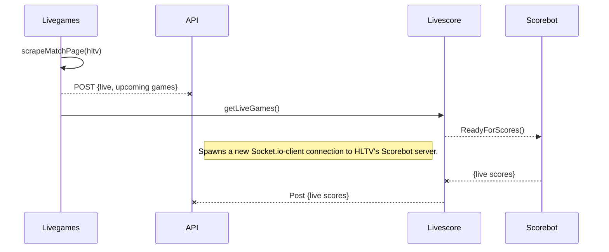
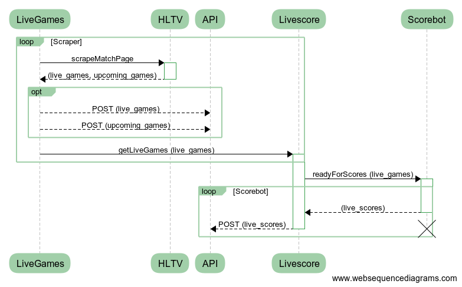

# HLTV Livescore


## Contents

-  [Introduction](#introduction)
-  [Getting Started](#getting-started)
-  [Usage](#usage)
-  [Methods](#methods)
-  [Events](#events)


## Introduction


This is a wrapper for [andrewda](https://github.com/andrewda)'s [hltv-scorebot](https://github.com/andrewda/hltv-livescore), v. 1.0.0. A *cheerio* web scraper monitors HLTV for live games and *socket-io* child processes are forked to monitor scores for each new set of live games:  






## Getting Started


**Install with npm:**


```console

$ git clone path-to-this-repo

$ npm install

```
**Index.js** is used for testing and development; **serverParent.js** runs the full program phases of scraping for new games, posting to the API, connecting to the Scorebot server, and monitoring live scores.  
  

## Usage

```console
node index.js # currently used for testing
node serverParent.js # this is the current entry point (sorry)

```
This project also comes with PM2 ecosystem files. They're in the root of the project folders. Use them like this:

```console
pm2 start ecosystem_win.json --env=development

```
You can also set environment variables manually, e.g. on Windows:

```console
// set environment to development:
set NODE_ENV=development
set API_URL=
set API_KEY=
node serverParent.js
```
And on Linux you can execute this as a shell script:
```console
#!/bin/bash
# must save this file in Unix format
cd 
cd livescore
sudo NODE_ENV=staging pm2 start serverParent.js
cd
cd livegames
sudo NODE_ENV=staging pm2 start serverParent.js
# TODO use an environment variable.
```

## Methods
  
### Constructor([options])

-  `options` - An optional object containing some of the following options

-  `listid` - The game's listid

-  `url` - The URL to listen on. Defaults to `https://scorebot-secure.hltv.org`

-  `port` - The port to listen on. Defaults to `80`


Constructs a new `Livescore`. You will be automatically connected to the HLTV scorebot server. The game with the specified `listid` will be automatically started if provided. If not provided, you must specify them using them using the `start()` method.

## Events

Events emit an object containing the parameters listed under each event.

### raw

Uses socket.io-wildcard to emit everything coming from HLTV server.